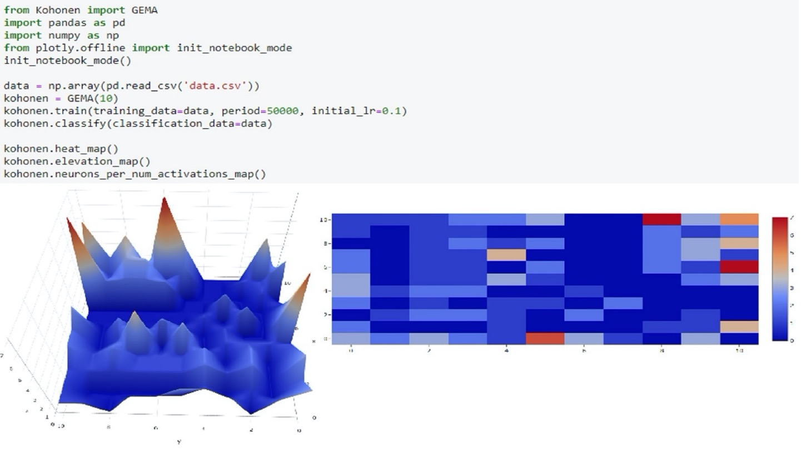
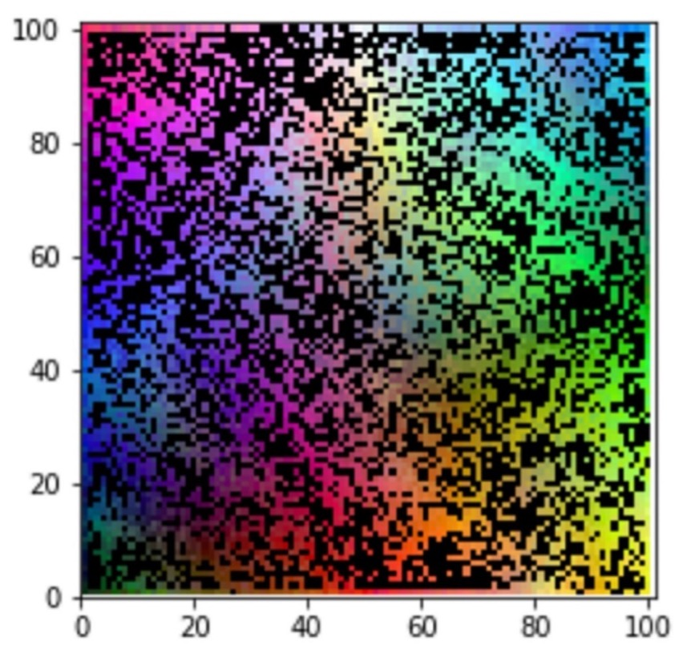

# Summary

The increasing availability of big amounts of data and the drop of computational capacity costs allow many hard problems to be solved by applying machine learning (ML) techniques, [@musumeci2018overview]. Thus, there is a growing need for ML libraries (implementation of algorithms and models), especially, in the open domain. In this scenario, artificial neural networks (ANN), a subset of biologically inspired ML techniques, are becoming more popular among the artificial intelligence community. This is a consequence of their capability to solve different problems and its good performance. There are many ANN models, but self-organizing maps (SOMs) are fundamentally different in terms of architecture and learning algorithms. SOMs, also known as Kohonen maps, are based on biological studies of the cerebral cortex and were introduced in 1982 by [@kohonen1982self], [@kohonen1990self]. This model is an ANN with an unsupervised training algorithm that performs non-linear mapping between high dimensional patterns and a discrete bidimensional representation, called feature map, without external guidelines. It is for that reason that SOM has been widely used as a method for pattern recognition, dimensionality reduction, data visualization, and cluster analysis (categorization), [@cottrell2018self]. GEMA, which stands for GEnerador de Mapas Autoasociativos (Self-associative Maps Generator in Spanish) is an implementation of Kohonen’s maps that builds a SOM from scratch in a two-step process: training and mapping/classification. The training process finds a coherent clustering (a feature map) using a set of input examples by defining and fine-tuning SOM parameters. The mapping process automatically classifies new input data using the trained network from the previous step. Also, GEMA implements facilities to analyze the results with reports and interactive visualization.

# Statement of Need

GEMA is a library that has been developed to facilitate the management of Kohonen maps. It allows data scientists to define and train SOMs, using them later to classify new instances from a target dataset. GEMA also helps to analyze the classifier itself and the classification results obtained by visualizing data and obtaining some metrics. GEMA is written in Python 3.7 with dependencies to some libraries. NumPy[1](http://www.numpy.org/), a package for scientific computing. Pandas, [@mckinney2011pandas], which is used to manage data structures. Matplotlib described in [@hunter2007matplotlib], imageio[2](https://github.com/imageio/imageio), and Plotly[3](https://plotly.com/) for visualizing the results. Scikit-learn, [@pedregosa2011scikit], and SciPy[4](http://www.scipy.org/) provide more complex mathematical functions. Finally, numba is a Python compiler that accelerates developed functions, [@lam2015numba]. 

# Software Framework

Neural networks require prior dataset manipulation to make it understandable by the network. These processes are grouped into a set of operations called preprocessing, mainly data normalization, although all statistical analysis of the dataset can also be carried out. The training/learning process involves an incremental adaptation of neurons’ weight vectors using a training dataset of unlabeled input vectors until a coherent clustering (a map) is obtained accordingly. A clean SOM is obtained as an instance of class GEMA by a call that sets the map side. It is very usual that once a good SOM has been obtained, the user is interested in saving it and use it in the future. To accomplish this task, the library provides the possibility of saving the information of the map as a JSON. Thus, a pre-trained model can also be loaded with this saved model. The process to classify a data set with a network using this library is practically the same as the training, except that no weight is modified, and other parameters are not necessary. Only the winning neuron is calculated for each sample to be categorized. The trained map receives unlabeled patterns to be clustered in the space by calculating a discriminant function (for example the Euclidean distance) between each element to be classified and the SOM weight matrix. Finally, a visualization/reporting stage where the user can ask for different plots and reports that provide a friendly interpretation of the results (input dataset and codebooks), cluster analysis and quality measurements. Fig. 1 describes all the methods and the different architectural elements involved.

Fig. 2 shows the same process by implementing the code. In this case a Kohonen map of size 10 is initialized and trained with data from a csv file. The training stage consists of 50000 epochs and uses a learning rate of 0.1. Then, this SOM is used to classify some data instances. At the end, two type of plots have been obtained: a 3D and a 2D heatmap.

# Comparison with other tools

Other Python libraries implement Kohonen maps. Kohonen[5](https://github.com/lmjohns3/kohonen) contains some implementations of Kohonen-style vector quantizers although it also supports Neural Gas and Growing Neural Gas. A very simple implementation of a Kohonen map library called som[6](https://github.com/alexarnimueller/som). Somoclu, [@wittek2013somoclu], also works with SOMs but it allows to parallelize the different tasks.  A package called PyMVPA for statistical learning analysis includes a class to model SOMs, [@hanke2009pymvpa].  NeuPy[7](https://github.com/itdxer/neupy) is a Neural Network library including also a class for Kohonen maps. Another library only for SOMs is SOMPy[8](https://github.com/sevamoo/SOMPY) which follows the structure of the Matlab somtoolbox. MiniSom[9](https://github.com/JustGlowing/minisom) is a minimalistic implementation of the Self Organizing Maps. Finally, SimpSOM[10](https://github.com/fcomitani/SimpSOM) is a lightweight implementation of Kohonen maps. These libraries implement a lot of the functions provided by GEMA. But in contrast, GEMA has new metrics like topology which provides quality about the density of the map. Users also request for more completed reports containing detailed information of the feature map. Finally, GEMA is the only one providing interactive visualization with graphs like a 3D elevation heatmap or a diagram bar showing how many neurons have been activated a certain number of times.

# Empirical results and evaluation

To test the library, it has been evaluated in a use case. A successful research has been conducted in the field of psychology by classifying students’ profiles regarding their competencies, [@nogales2019competencies]. In the following paragraphs, the experiments for each use case will be explained. The results obtained will be represented in graphs. In the results, it can be seen that patterns with the same characteristics are clustered in similar zones. It should be highlighted that these graphs are not part of the library and have been developed itself only to evaluate the results obtained with the library.

# References
